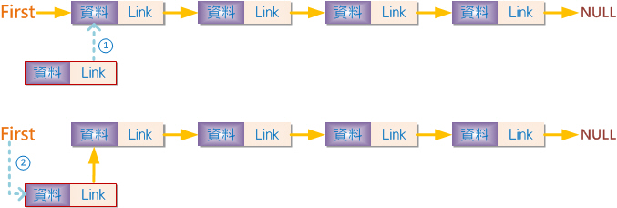
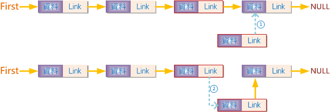
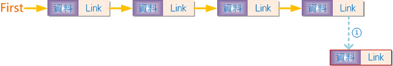

# C MID3 Notes

## Maze

迷宮，左手法則

### Example Input

```
############
##XXXXX#XXX#
##X###X###X#
##X#XXXXXXX#
##X#######X#
#XX#X####XX#
XX##XXXXXX##
####X##X##X#
#X#X#XXX##X#
#X#X##X#XXX#
#XXX##XXX#XX
############
```

### Example Output

```
############
##RRRRR#RRR#
##R###R###R#
##R#XXRRRRR#
##R#######R#
#RR#X####RR#
RR##XXXRRR##
####X##R##R#
#X#X#XRR##R#
#X#X##R#RRR#
#XXX##RRR#RR
############
```

### Code

```c
#include <stdio.h>
#include <stdbool.h>
#include <string.h>

#define WIDTH 12
#define HEIGHT 12

typedef struct {
    int x;
    int y;
} Pos;

Pos pt(int, int);
void findStartPos(char[HEIGHT + 1][WIDTH + 1], Pos*);
bool findEndPos(char[HEIGHT + 1][WIDTH + 1], Pos*);
bool step(char[HEIGHT + 1][WIDTH + 1], Pos, Pos, int);
void printMaze(char[HEIGHT + 1][WIDTH + 1]);
Pos rotate(Pos, int);

Pos pt(int x, int y) {
    Pos p = { x, y };
    return p;
}

void findStartPos(char maze[HEIGHT + 1][WIDTH + 1], Pos *start_pos) {
    for (int i = 0; i < HEIGHT; i++) {
        if (maze[i][0] == 'X') {
            start_pos->x = i;
            start_pos->y = 0;
            return;
        }
    }
}

bool findEndPos(char maze[HEIGHT + 1][WIDTH + 1], Pos* end_pos) {
    for (int i = 0; i < HEIGHT; i++) {
        if (maze[i][WIDTH - 1] == 'X') {
            end_pos->x = i;
            end_pos->y = WIDTH - 1;
            return true;
        }
    }
    return false;
}

int dirs[][2] = {
    {0, 1},
    {-1, 0},
    {0, -1},
    {1, 0}
};

bool step(char maze[HEIGHT + 1][WIDTH + 1], Pos start, Pos end, int dir) {
    if (maze[start.x][start.y] == 'X') {
        maze[start.x][start.y] = 'R';
        int d;
        if (maze[end.x][end.y] != 'R' &&
            !(step(maze, rotate(start, (d = (dir + 1) % 4)), end, d) ||
            step(maze, rotate(start, (d = (dir + 4) % 4)), end, d) ||
            step(maze, rotate(start, (d = (dir + 3) % 4)), end, d) )) {
            //maze[start.x][start.y] = 'X';
        }
    }
    return maze[end.x][end.y] == 'R';
}

Pos rotate(Pos pos, int dir) {
    return pt(pos.x + dirs[dir][0], pos.y + dirs[dir][1]);
}

void printMaze(char maze[HEIGHT + 1][WIDTH + 1]) {
    for (int i = 0; i < HEIGHT; i++) {
        printf("%s", maze[i]);
        if(i != HEIGHT - 1) printf("\n");
    }
}

int main() {
    Pos pos = { 0, 0 };
    Pos start_pos = { 0, 0 };
    Pos end_pos = { 0, 0 };
    char maze[HEIGHT + 1][WIDTH + 1] = { { '\0' } };
    for (int i = 0; i < HEIGHT; i++) {
        for (int j = 0; j < WIDTH + 1; j++) {
            char c = getchar();
            if (c != '\n') {
                maze[i][j] = c;
            }
        }
    }
    findStartPos(maze, &start_pos);
    bool valid = findEndPos(maze, &end_pos);
    valid &= step(maze, start_pos, end_pos, 0);
  	printMaze(maze);
    if (!valid) {
        printf("\nThis maze has no solution");
    }
    return 0;
}
```

## Linked List

鏈結串列

### maic.c

```c
#include <stdio.h>

// Implements structures and functions in this header file
#include "func.h"

// Program entry point
int main() {
    // List of student names, list end with an empty string
    char names[][LEN_NAME] = { "Caspar Murray", "Rory Gordon", "Winnie Randolph", "" };

    // The English and Math score of each student
    int scores[][2] = { {50, 25}, {50, 50}, {50, 100} };

    // Convert upon array lists into a linked list
    struct student* first = convert(names, scores);

    // Iterate through each student
    while (first) {
        // Print student score information in required format
        printf("%s, %d, %d\n", first->name, first->english, first->math);

        // Jump to next student
        first = first->next;
    }

    return 0;
}
```

### func.h

```c
#pragma once
#include <string.h>
#include <stdlib.h>

// The string length of name
#define LEN_NAME 50

// A structure represents the information of each student
struct student {
    // The name string
    // Parameter: name (string)
    char name[LEN_NAME];

    // The score of English
    // Parameter: english (integer)
    int english;

    // The score of Math
    // Parameter: math (integer)
    int math;

    // Pointer to next student
    // Parameter: next (pointer)
    struct student* next;
};

typedef struct student Student;

/// <summary>
/// Convert the given 2 arrays into a linked list using 'student' structure.
/// </summary>
/// <param name="names">The name list.</param>
/// <param name="scores">The score list</param>
/// <returns>The first node of the created linked list.</returns>
Student* last;
struct student* convert(char names[][50], int scores[][2]) {
    int len = 0;
    while (1) {
        if (strlen(names[len]) == 0) break;
        len++;
    }
    Student* temp = 0;
    for (int i = 0; i < len; i++) {
        temp = (Student*) malloc(sizeof(Student));
        strcpy(temp->name, names[(len-1) - i]);
        temp->english = scores[(len - 1) - i][0];
        temp->math = scores[(len - 1) - i][1];
        temp->next = (i != 0) ? last : 0;
        last = temp;
    }
    return temp;
}
```

### 刪除資料範例

```c
//刪除 n 的下一個 node
void remove_node(Data* n) {
    //宣告一指標指向 n 的下一個節點
    Data* temp = n->next;

    //將 n 指向下下一個節點
  n->next = n->next->next;

  //釋放被刪除節點的記憶體空間
  free(temp);
}
```

### 插入資料

#### 前端插入



#### 中間插入



#### 尾端插入



```c
Node *createNode(void) {
    Node *tmpNode;
    tmpNode = (Node *) malloc(sizeof(Node));
    if(tmpNode == NULL){
        printf("記憶體不足");
        exit(1);
    }
    return (tmpNode);
}

void insert(Node *first, Node x) {
    Node tmp;
    MALLOC(tmp, sizeof(*tmp));
    tmp->data = 50;
    if(*first){
        tmp->link = x->link;
        x->link = tmp;
    }else{
        tmp->link = NULL;
        *first = tmp;
    }
}

Node *insertNode( Node *first, Node *theNode, int data)} {
    Node *newNode;
    newNode = createNode();
    newNode = data;
    newNode->link = NULL;
    if( theNode == NULL ){            //前端插入
        newNode->link = first;
        first = new;Node;
    }else{
        if(theNode->link == NULL)    //尾端插入
            theNode->link = newNode;
        else{                           //中間插入
            newNode->link = theNode->link;
            theNode->link = newNode;
        }
    }
    return (first);
}
```

## Bubble Sort

```c
void bubbleSort(int arr[], int len) {
	int i, j, temp;
	for (i = 0; i < len - 1; ++i)          //循環N-1次
		for (j = 0; j < len - 1 - i; ++j)  //每次循環要比較的次數
			if (arr[j] > arr[j + 1]) {       //比大小後交換
				temp = arr[j];
				arr[j] = arr[j + 1];
				arr[j + 1] = temp;
			}
}
```
